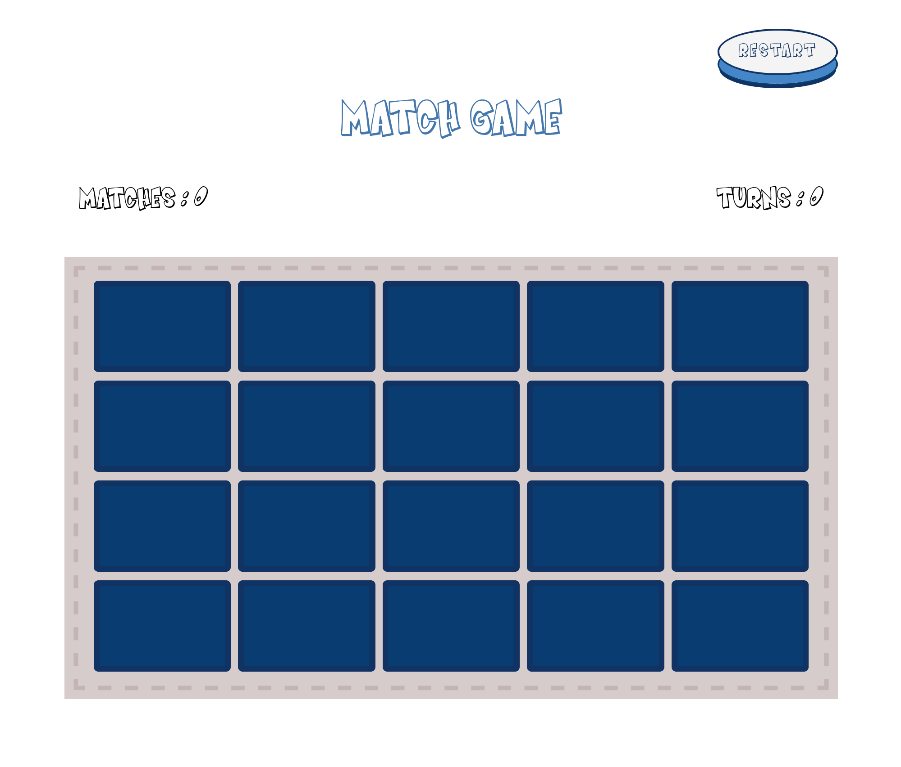
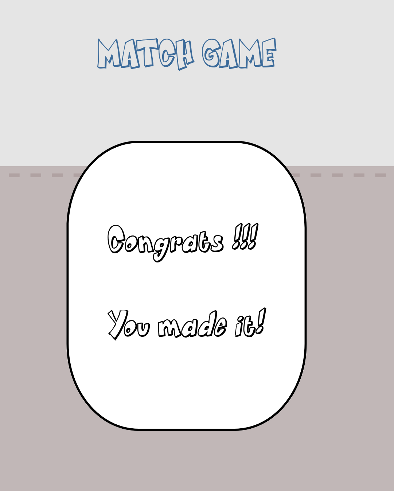

# Simple app with matching game.

## Table of contents

- [Overview](#overview)
  - [The challenge](#the-challenge)
  - [Screenshot](#screenshot)
  - [Links](#links)
- [My process](#my-process)
  - [Built with](#built-with)
- [Author](#author)

## Overview

### The challenge

Users should be able to :

- play the game
- reset game
- track current successful matches and score

### Screenshot

### Links

Live Site URL: [Match Game](https://jolka-ef.github.io/react-match-game/)

## My process

### Built with

- Semantic HTML5 markup
- CSS custom properties
- CSS modules
- CSS grid
- Mobile-first workflow
- [React](https://reactjs.org/) - JS library

### What I've learned

- Gain knowledge of React useRef() hook

## Author

jolka_ef
